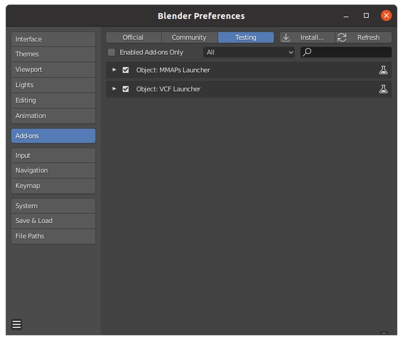

# BlenderでMMAPsを生成するモジュール
- これは、Micro-Mirror Array Platesをblender内で再現するためのモジュールです。
- 使用方法は[こちら](https://www.media.lab.uec.ac.jp/?p=2569)を参照下さい。

- MMAPsの再現性に関しては[論文](https://doi.org/10.1016/j.cag.2021.02.007)をご確認下さい。
  -  Shunji Kiuchi, Naoya Koizumi. Simulating the appearance of mid-air imaging with micro-mirror array plates. *Computers & Graphics*,2021.
-  vcf(Louver film)は再現できていません。簡易的なものになっています。

- mmaps/ ... MMAPs作成用アドオンフォルダ(開発用)
  - __init__.py       ... 初期化ファイル
  - mmaps.py          ... MMAPs生成/削除用モジュール
  - myutil.py         ... Utility関数モジュール
  - mmaps_clearer.py  ... MMAPs削除用オペレータクラス
  - mmaps_launcher.py ... MMAPs生成用オペレータクラス
  - mmaps_manager.py  ... パラメータ管理用パネルクラス
- vcf/
  - __init__.py       ... 初期化ファイル
  - vcf.py            ... VCF生成/削除用モジュール
  - myutil.py         ... Utility関数モジュール
  - vcf_clearer.py    ... VCF削除用オペレータクラス
  - vcf_launcher.py   ... VCF生成用オペレータクラス
  - vcf_manager.py    ... パラメータ管理用パネルクラス
- mmaps.zip           ... インストール用(MMAPs)
- vcf.zip             ... インストール用(VCF)

# 検証version
- Blender 2.8.1

# Setup

- Edit -> Preferences を立ち上げ、Add-ons を選択
- Testing を選択後、Install を押す。
  - 
- ファイルエクスプローラーが出るので、`mmaps.zip` or `vcf.zip` を選択。

# パラメータの設定
- MMAPsサイズ  : 48.8
- スリット間隔 : 0.05
- 高さ比率     : 2.5
- ミラー分割数 : 10
- 反射率       : 0.87
- 屈折率       : 1.52

# 開発用メモ
- 開発時は、`mmaps/` or `vcf/` 以下のpythonファイルを修正し、修正終了後は 各ディレクトリを zip 形式に圧縮してください。

# Functions

> **showParam(_mirror_name = 'Mirror', glass_name = 'Glass', parent_name = 'MMAPs'_)**

MMAPsのパラメータ(一辺の長さ、スリット間隔、高さ比率、分割数)を表示

**Paramters**
- `mirror_name` (string) - ミラーの名前 _[optional]_ 
- `glass_name` (string) - ガラスの名前 _[optional]_ 
- `parent_name` (string) - MMAPsの姿勢を制御するための親(空)オブジェクトの名前 _[optional]_ 

---
> **getParam(_mirror_name = 'Mirror', glass_name = 'Glass', parent_name = 'MMAPs'_)**

MMAPsのパラメータ(一辺の長さ、スリット間隔、高さ比率、分割数)を返す

**Paramters**
- `mirror_name` (string) - ミラーの名前 _[optional]_ 
- `glass_name` (string) - ガラスの名前 _[optional]_ 
- `parent_name` (string) - MMAPsの姿勢を制御するための親(空)オブジェクトの名前 _[optional]_ 

**Returns**
- `size` (float) - 一辺の長さ
- `spacing` (float) - スリット間隔
- `height_scale` (float) - 高さ比率
- `detailing` (float) - 分割数
- `isGlass` (bool) - ガラスの有無

> **clearMMAPs(_mirror_name = 'Mirror', glass_name = 'Glass', parent_name = 'MMAPs'_)**

MMAPs(ミラー、ガラス、空オブジェクトで構成される)を削除する
    
**Paramters**
- `mirror_name` (string) - ミラーの名前 _[optional]_ 
- `glass_name` (string) - ガラスの名前 _[optional]_ 
- `parent_name` (string) - MMAPsの姿勢を制御するための親(空)オブジェクトの名前 _[optional]_ 

---

> **createMMAPs(_size, spacing, height_scale = 3, overwrite=True_)**

MMAPsを生成する

**Parameters**
- `size` (float) - MMAPsの一辺の大きさ
- `spacing` (float) - スリットミラー間の間隔
- `height_scale` (float) - スリット間隔を基準としてスリットの高さを決めるための倍率
- `overwrite` (bool) - MMAPsが存在した場合に上書きするかどうか。`True`の場合、既存のMMAPsを削除してから新規生成する _[optional]_ 
- `isGlass` (bool) - ガラスの有無 _[optional]_ 
- `glass_center` - ガラスが真ん中かどうか _[optional]_ 
- `ior` - ガラスの屈折率 _[optional]_ 

---

> **createDetailedMMAPs(_size, spacing, detailing = 10, height_scale = 3.0, overwrite=True, isGlass=True, glass_center=False, ior=1.45_)**

各スリットミラーを分割したMMAPsを生成する

**Parameters**
- `size` (float) - MMAPsの一辺の大きさ
- `spacing` (float) - スリットミラー間の間隔
- `detailing` (int) - 各ミラーの分割数。デフォルトでは各ミラーを10分割する。
- `height_scale` (float) - スリット間隔を基準としてスリットの高さを決めるための倍率
- `overwrite` (bool) - MMAPsが存在した場合に上書きするかどうか。`True`の場合、既存のMMAPsを削除してから新規生成する _[optional]_ 
- `isGlass` (bool) - ガラスの有無 _[optional]_ 
- `glass_center` - ガラスが真ん中かどうか _[optional]_ 
- `ior` - ガラスの屈折率 _[optional]_ 

---

> **attachMaterial(_obj, mat_name_)**

オブジェクトにマテリアルを設定する。`mat_name`で指定される名前のオブジェクトが存在しない場合は新規に作成する。

**Parameters**
- `obj` (BlendDataObjects) - マテリアルを設定する対象のオブジェクト
- `mat_name` (string) - マテリアルの名前

---

> **attachMirrorMaterial(_obj, mat_name_)**

オブジェクトに鏡のマテリアルを設定する。`mat_name`で指定される名前のオブジェクトが存在しない場合は新規に作成する。

**Parameters**
- `obj` (BlendDataObjects) - マテリアルを設定する対象のオブジェクト
- `mat_name` (string) - マテリアルの名前

---

> **attachGlassMaterial(_obj, mat_name, ior=1.45_)**

オブジェクトにガラスのマテリアルを設定する。`mat_name`で指定される名前のオブジェクトが存在しない場合は新規に作成する。

**Parameters**
- `obj` (BlendDataObjects) - マテリアルを設定する対象のオブジェクト
- `mat_name` (string) - マテリアルの名前
- `ior` - ガラスの屈折率 _[optional]_ 

---

> **addMirror(_parent, verts, faces, obj_name = 'Mirror', id = None_)**

ミラーを生成する。MMAPs内部のミラーを想定しているので、親オブジェクト(`parent`)は必須。

**Parameters**
- `parent` (BlendDataObjects) - 親オブジェクト
- `verts` (array) - 頂点情報
- `faces` (array) - 頂点番号情報(インデックス)
- `obj_name` (string) - オブジェクトの名前
- `id` (int) - ミラーの番号

---

> **addGlass(_parent, size, height, obj_name = 'Glass'_)**

ガラスを生成する。MMAPs内部のガラスを想定しているので、親オブジェクト(`parent`)は必須。

**Parameters**
- `parent` (BlendDataObjects) - 親オブジェクト
- `size` (float) - ガラスの一辺の大きさ
- `height` (float) - ガラスの高さ
- `obj_name` (string) - オブジェクトの名前
- `glass_center` - ガラスが真ん中かどうか _[optional]_ 

